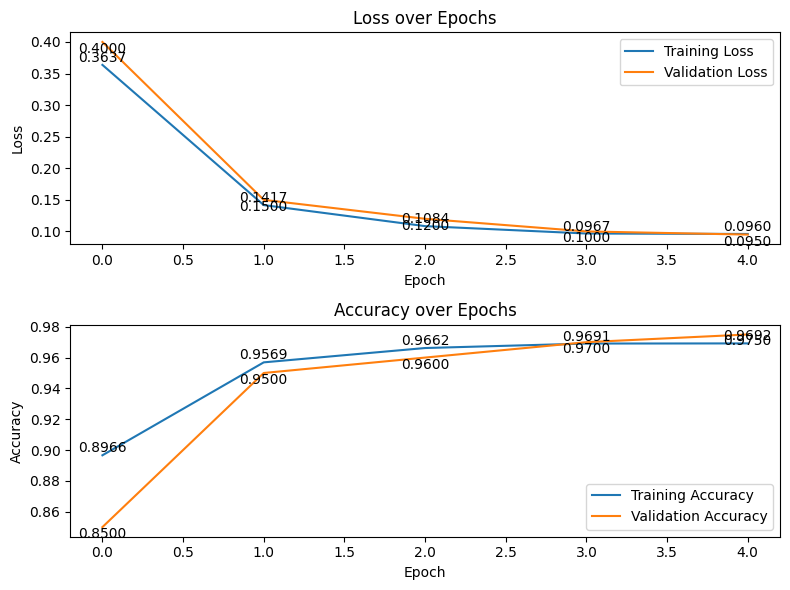

Here’s the corrected and improved version of your README.md file:

```markdown
# Few-Shot Learning with the Omniglot Dataset

This project explores few-shot learning using the Omniglot dataset. The goal is to implement and evaluate a machine learning model capable of learning from minimal samples, suitable for scenarios with limited labeled data.

## Overview

Few-shot learning is a subset of machine learning where the objective is to generalize effectively from only a few training examples. The Omniglot dataset is commonly used in this domain due to its diversity and challenging nature.

### Key Features

- **Dataset**: The Omniglot dataset contains handwritten characters from 50 different alphabets, with a total of 1,623 characters. Each character has 20 examples.
- **Objective**: Train a model capable of recognizing new characters with limited examples.
- **Methodology**: Leverages deep learning techniques, including convolutional neural networks (CNNs), for feature extraction and classification.
- **Evaluation**: Performance is measured in terms of accuracy and generalization to unseen classes.

## Installation

### Steps

1. Clone this repository:
   ```bash
   git clone https://github.com/rimu-7/Omniglot-Dataset-Few-Shot-Method.git
   ```
2. Navigate to the project directory:
   ```bash
   cd Omniglot-Dataset-Few-Shot-Method
   ```
3. Install dependencies:
   ```bash
   pip install -r requirements.txt
   ```

## Dataset

The Omniglot dataset is included in the `datasets` directory or can be downloaded from [Brenden Lake's Omniglot project page](https://github.com/brendenlake/omniglot). The dataset includes:

- Images of handwritten characters in various languages.
- Pre-split into training and test sets.

## Navigation

- `README.md`: This file, containing project information and instructions.
- `requirements.txt`: File listing required libraries for installation.
- `omniglot_dataset_few_shot.ipynb`: Notebook for interactively testing the model.

## Usage
- `for training`
Open the file in your jupyter notebook or google colab.

## Results

- **Final Loss**: 0.0960  
- **Final Accuracy**: 0.9692  
- **Training Accuracy**: [0.8966, 0.9569, 0.9662, 0.9691, 0.9692]
- **Validation Accuracy**: [0.85, 0.95, 0.96, 0.97, 0.975]

Visualizations of the accuracy and loss graphs are included in the notebook.


## Contributing

Contributions are welcome! Please submit a pull request or create an issue for suggestions.

## Acknowledgments

- The creators of the Omniglot dataset.
- Tutorials and resources on few-shot learning.
```